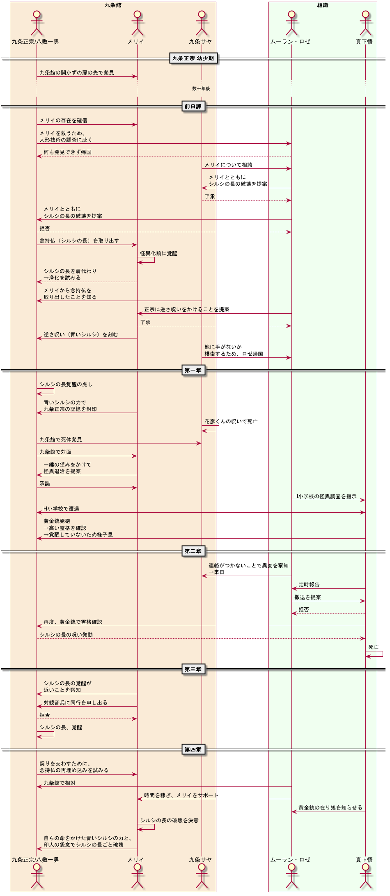
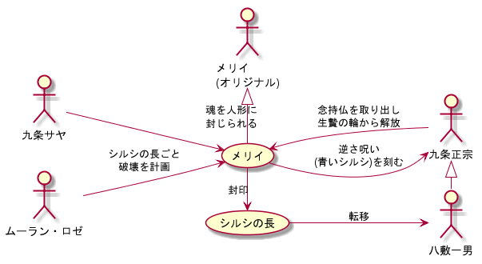

# siin_uml

ボイスドラマ「死印 青き終焉」の第四章にカッとなって、UMLで情報を整理してみました。ただの自己満足です。だけど、後悔はしていません。  

ネタバレをものすごく含むので、閲覧時要注意。

## 目的

「死印 青き終焉」の情報を整理するため、試しに作ってみました。  
絵心も音楽的才能もないからそっち分野で応援できないけれど、コーディングでなら多少はできるんじゃないかと、ふと閃いた結果の産物です。  
ついでにGit(GitHub)、オブジェクト指向、PlantUMLの習得も兼ねていたり。  

「ここは、こうではないか」という指摘、大歓迎です。

## 元ネタ

[ボイスドラマ 死印 青き終焉|死印](http://shiin.jp/special/voice-drama-2nd.html)

## 制作環境

- OS : Windows 10 Pro
- IDE : VS Code
- Tools : PlantUML

## シーケンス図

第四章組＋真下を軸に、誰がいつ何をやっていたのかまとめようと作成。  
メリイとサヤさんの繋がりが全く無いことに気付いた。

## ユースケース図

第四章組の関係性をユースケース図で作成。  
メリイ（人形）を「シルシの長封印システム」に見立てて、メリイを中心に書いてみた。  

