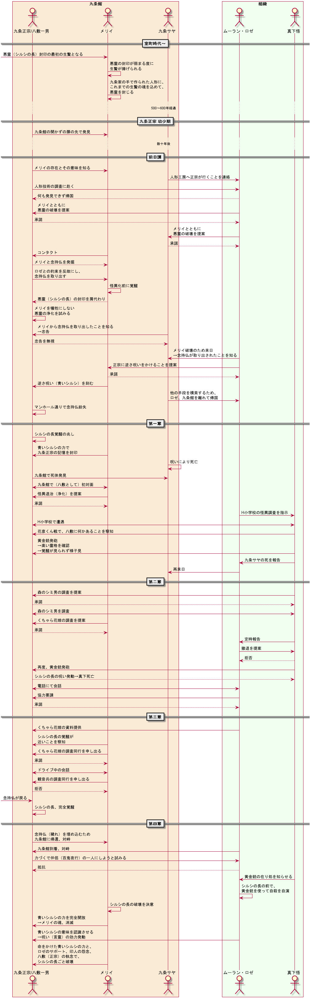

# siin_uml

ボイスドラマ「死印 青き終焉」の第四章にカッとなって、UMLで表現してみた。後悔はしていない。  
ネタバレをものすごく含むので、閲覧時要注意。

## 目的

「死印 青き終焉」の情報を整理するため＆応援の意味も込めて、試しに作ってみた。  
絵心も音楽的才能もないけれど、コーディングなら多少はできるじゃないかと、ふと閃いた結果の産物。  

「ここはこうではないか」という指摘、大歓迎。

## 制作環境

- OS : Windows 10
- IDE : VS Code
- Tools : PlantUML

## シーケンス図

第四章組＋真下を軸に、誰がいつ何をやっていたのかまとめようと作成。  
メリイとサヤさんの繋がりが全く無いことに気付いた。

